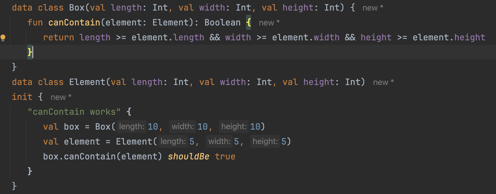
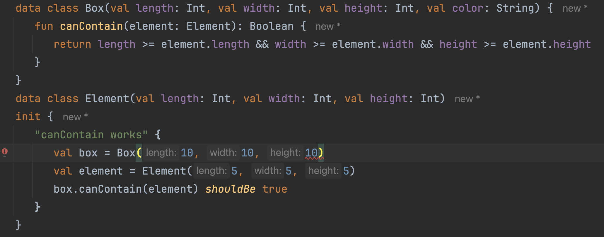

## Build Precise And Maintainable Tests With Kotest

#### Alex Kuznetsov

---

Kotest is modern, flexible, and very powerful. When used properly, it can make our life much easier. But sometimes we need to design away the need to use complex tools.


---

#### First example: match lists where elements are data classes with many fieds

```
listOf(...) shouldBe listOf(...)
```
with `shouldBe`, not easy to see what exactly is different

```kotlin
Expected :[SpaceShip(name=Millennium Falcon, description=Han Solo ship, range=10, capacity=10, serialNumber=123456), SpaceShip(name=Ghost, description=seen in Rogue One, range=10, capacity=10, serialNumber=Unknown), SpaceShip(name=CR90 corvette, description=Blockade Runner, range=10, capacity=10, serialNumber=123456), SpaceShip(name=CR90 corvette, description=Blockade Runner, range=10, capacity=10, serialNumber=123356)]
Actual   :[SpaceShip(name=CR90 corvette, description=Blockade Runner, range=10, capacity=10, serialNumber=123457), SpaceShip(name=Millennium Falcon, description=Han Solo ship, range=10, capacity=10, serialNumber=123456), SpaceShip(name=Ghost, description=seen in Rogue One, range=10, capacity=10, serialNumber=Unknown), SpaceShip(name=CR90 corvette, description=Blockade Runner, range=10, capacity=10, serialNumber=123456), SpaceShip(name=CR90 corvette, description=Blockade Runner, range=10, capacity=10, serialNumber=123457)]
```

---

* `shouldBe` Is A Swiss Army Knife
* Does Lots Of Things
* Specialized Tools Are Better


---

### Matching lists a common problem
#### Let's improve it

I am not a visionary. I'm an engineer. I'm happy with the people who are wandering around looking at the stars but I am looking at the ground and I want to fix the pothole before I fall in.

Linus Torvalds

---

## We've built a better Matcher
Test fails because elements are in wrong order


---

## Match Two Slices
Matcher finds two slices that match exactly


---

##### Lessons learned:

* Kotest is designed and built by a committee
* But it's a committee of us practitioners 
* 377 contributors, 4.5K stars on GitHub
* If you have a problem, maybe kotest already has a solution

---

Let's return to matching collections - kotest has much more to offer.

---

Example of specific assertion: when order does not matter


---

If kotest cannot find a match, it will search for similar elements


---

How to match ordered collections if order is not completely predictable


---

How to be not too specific when we match numbers

---

`BigDecimal` and scale - be specific enough, but not too much

test end result, not how it was computed


---

Double Numbers Are Not Precise - be specific enough, but not too much


Similar matchers for temporal types

---

Let's apply this knowledge.
<br/>
Scenario 1. refactor a test to be more specific and less fragile

---

## Scenario 1. Matching JSON - Naive Test

Fragile: order of keys in JSON is not guaranteed

```kotlin
toPayload(myInstance) shouldBe 
        """{"destination":"01234","send_to":"Jane Doe"}"""
```

---

Scenario 1: the order of fields in JSON should not matter
<br/>
but this test fails:

```kotlin
"""{"destination":"01234","send_to":"Jane Doe"}""" shouldBe 
        """{"send_to":"Jane Doe","destination":"01234"}"""
```

---

Scenario 1: `shouldEqualJson` is Specialized, More Robust

```kotlin
"""{
    "destination":"01234",
    "send_to":"Jane Doe"
    }
    """ shouldEqualJson 
        """{"send_to":"Jane Doe","destination":"01234"}"""
```

---


Scenario 1: `shouldEqualJson` is Specialized, More Robust, but

if we add a new field to the object being serialized, the test will fail:

```kotlin

toPayload(
    MyPackage("01234", "Jane Doe", weight=2.34)
) shouldEqualJson 
        """{"send_to":"Jane Doe","destination":"01234"}"""
```

---

#### Scenario 1: why do we even need this test? what exactly are we verifying?

We use a very common library to serialize objects to JSON. 
<br/>
<br/>
We should not be testing that library.

---

#### Scenario 1: The need to unit test json 
Passing Around Zip Codes

```kotlin
data class ZipCode(
    val zip: String
) {
    public constructor(...) {
        //custom initialization logic
    }
    init {
        //validation
    }
}
// val destination: ZipCode should serialize to JSON 
// as "destination":"01234"
// not as "destination":{"zip":"1234"}
```

---
Scenario 1:
- We are testing if our custom serializer is properly plugged in
- use the right tool - `shouldContainJsonKeyValue`

```kotlin
val package = MyPackage(
    destination = ZipCode(1234), 
    sendTo = "Jane Doe",
    weight = 2.34,
)
val actual = createPayload(package)
        
actual.shouldContainJsonKeyValue("destination", "01234") 
```
---

## Test One Specific Thing, Not The Whole Context

* tests will be precise and maintainable.
* but is can be more effort to write them.
* so it might or might not be worth it.
* not a blanket recommendation

---

Invest more effort in making tests more readable? 
<br/>
Or leave them as is.


---

How to be more precise when matching data classes:

* Ignore timestamps, identities, UUIDs, etc.
* need detailed description of what exactly is different

---

How To Match Data Classes


---

How To Match Only Some Fields


---

 `assertSoftly`
<br/>
<br/>

```kotlin
assertSoftly {
    actual.color shouldBe "red"
    actual.taste shouldBe "sweet"
}
```

---

Scenario 2.
<br/>
Let's talk more about tests that are easy to maintain.
<br/>
<br/>
When a change to code causes too many changes to tests, this may be a code smell.
<br/>
<br/>
We might need to refactor the code.

---

Scenario 2: Tests can be fragile because tight coupling in code being tested



---

Scenario 2: `canContain` should depend only on dimensions of the box and the element


---

Scenario 2: Add an irrelevant field, need to update test



---

Scenario 2: Use exemplar instance and `copy`


---

Scenario 2: use interface to reduce coupling

```kotlin
   interface HasDimensions {
      val length: Int
      val width: Int
      val height: Int
   }
   
   fun HasDimensions.canContain(element: HasDimensions): Boolean { TODO() }
```
---

Scenario 2: less fragile test


---

Scenario 3.
When writing self-explanatory tests helps to figure out what exactly failed.

---

Scenario 3: Let's test upserting some data into a table


| name | before upsert | after upsert |
|------|---------------|----------------|
| apple| green         | green         |
| banana| yellow        | green         |
| cherry| -             | red           |

---

Scenario 3: validate everything in one test, not self-documenting

```kotlin
// insert test data:
// Fruit("apple", "green"),
// Fruit("banana", "yellow"),

dao.upsert(listOf(
    Fruit("banana", "green"),
    Fruit("cherry", "red"),
))

dao.getAll() shouldContainExactlyInAnyOrder listOf(
    Fruit("banana", "green"),
    Fruit("cherry", "red"),
    Fruit("apple", "green"),
)
```
It might be good enough already, but if not...

---

Scenario 3: If, and only if, we need four more readable tests

```kotlin
val actual = dao.getAll()

"should have rowToKeepAsIs" {
    actual shouldContain(rowToKeepAsIs)
}
"should have rowToUpdate" {
    actual shouldContain(rowToUpdate)
}
"should have rowToInsert" {
    actual shouldContain(rowToInsert)
}
"should not contain any other rows" {
    actual shouldContainExactlyInAnyOrder listOf(
        rowToKeepAsIs, rowToUpdate, rowToInsert
    )
}
```

---

#### Flaky tests because race conditions

- If something is 
  - shared
  - mutable
- then we can have race conditions  

Solutions?

* either do not mutate
* or do not share, run consecutively

---

Sometimes we must run consecutively, such as testing against Postgres.

```kotlin
@DoNotParallelize
class TestUsingItemsTable: StringSpec() {
    // setup/teardown test data in Items table
    // Test CRUD against Items table
}

@DoNotParallelize
class AnotherTestUsingItemsTable: StringSpec() {
    // setup/teardown test data in Orders and Items tables
    // test some joins of both tables
}
```

---

Mocking static methods can cause race conditions or break other tests, such as:

```kotlin
mockkStatic(LocalDateTime::class)
val localTime = LocalDateTime.of(2022, 4, 27, 12, 34, 56)
every { LocalDateTime.now(any<Clock>()) } returns localTime
```

while code on another thread is using 
```kotlin
LocalDateTime.now()
```

---

When we mock a static function, we may mutate a shared resource. And when we run tests in parallel, we share that mutable resource.
<br/>
We can use `@DoNotParallelize` as before.
<br/>
Or we can design away the need to mutate.

---

#### Design away the need to mutate

```kotlin
fun interface HasNow { fun now(): LocalDateTime }

class MyService(private val hasNow: HasNow) {
    fun printNow() = println(hasNow.now())
}

class HasNowTest: StringSpec() {
    init {
        "wired for prod" {
            val wiredForProd = MyService { LocalDateTime.now() }
            wiredForProd.printNow()
        }
        "wired for tests" {
            val wiredForProd = MyService { 
                LocalDateTime.of(2024, 11, 28, 1, 2, 3) 
            }
            wiredForProd.printNow()
        }
    }
}
```

---

#### Alternatively, use a wrapper

If the frameworks requires it, we may have to use a wrapper:
```kotlin
class WallClockWrapper(
    fun now() = LocalDateTime.now()
)
```
This is a regular class, which we can inject into services, pass into functions, and easily mock. And we don't need to share that mock.

---


Thank you!
<br/>
<br/>
Questions?