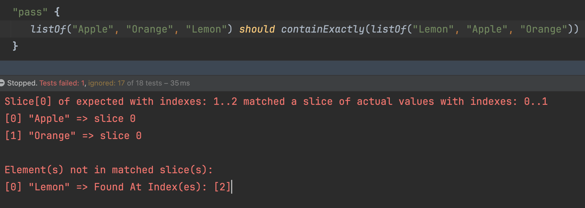
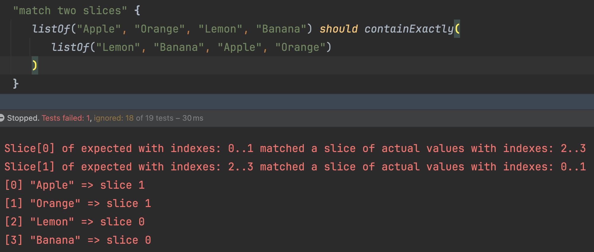
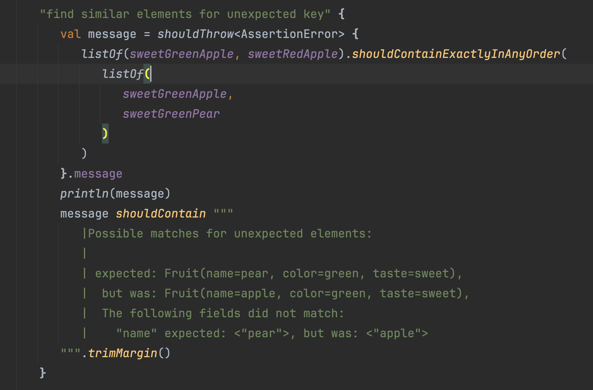
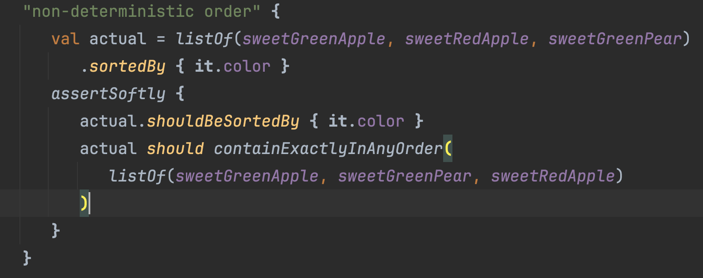
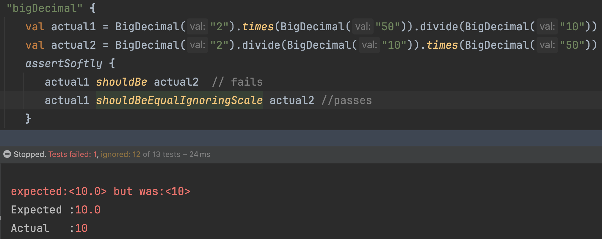
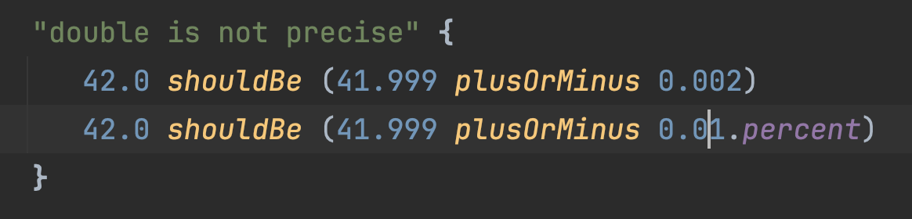
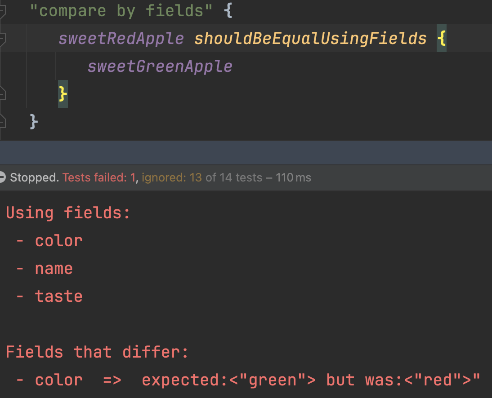
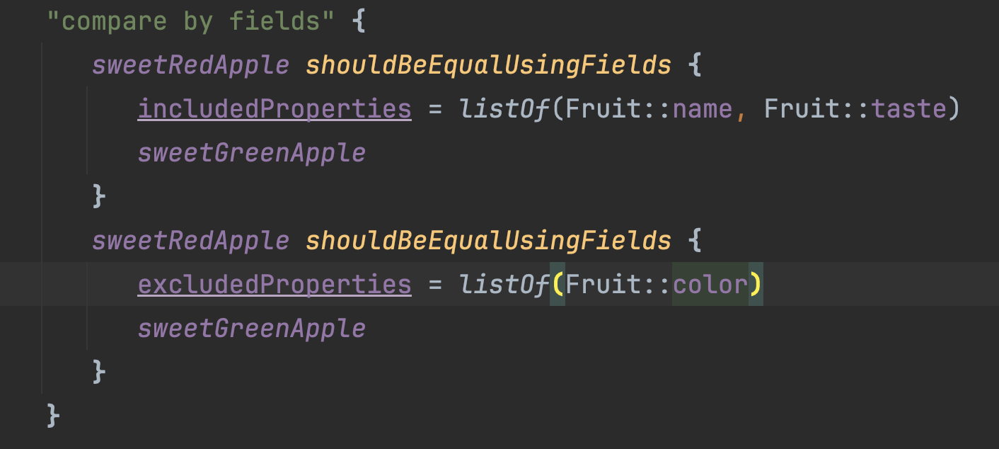
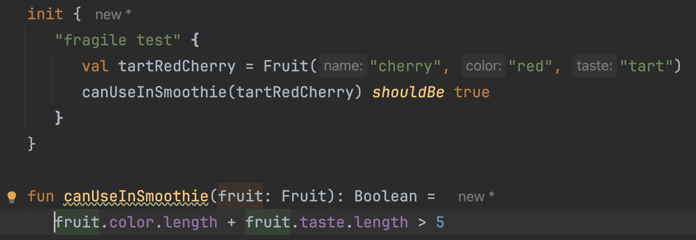

## Build Precise And Maintainable Tests With Kotest

#### Alex Kuznetsov

---

## TL;DR `shouldBe` Is A Swiss Army Knife

* Does Lots Of Things
* Specialized Tools Are Better

---

## Matching JSON - Naive Test

```kotlin
toPayload(myInstance) shouldBe 
        """{"destination":"01234","send_to":"Jane Doe"}"""
```

---
## Matching JSON - Fragile Test

the order of fields in JSON should not matter, but this fails:

```kotlin
"""{"destination":"01234","send_to":"Jane Doe"}""" shouldBe 
        """{"send_to":"Jane Doe","destination":"01234"}"""
```

---

## `shouldEqualJson` is Specialized, More Robust

```kotlin
"""{
    "destination":"01234",
    "send_to":"Jane Doe"
    }
    """ shouldEqualJson 
        """{"send_to":"Jane Doe","destination":"01234"}"""
```

---


## `shouldEqualJson` is Specialized, More Robust, but

if we add a new field to the object being serialized, the test will fail:

```kotlin
val actual = """{
    "destination":"01234",
    "send_to":"Jane Doe",
    "weight":2.34}
    """
actual shouldEqualJson 
        """{"send_to":"Jane Doe","destination":"01234"}"""
```

---


## why do we even need this test? what exactly are we verifying?

We use a very common library to serialize objects to JSON. 
<br/>
<br/>
We should not be testing that library.

---

## Real Life Example 
Passing Around Zip Codes

```kotlin
data class ZipCode(
    val zip: String
) {
    public constructor(...) {
        //custom initialization logic
    }
    init {
        //validation
    }
}
// val destination: ZipCode should serialize to JSON 
// as "destination"="01234"
```

---

## Is our custom serializer properly plugged in?

```kotlin
val package = Package(
    destination = ZipCode(1234), 
    sendTo = "Jane Doe",
    weight = 2.34,
)
val actual = createPayload(package)
        
actual.shouldContainJsonKeyValue("destination", "01234") 
```
---

## Test One Specific Thing, Not The Whole Context

* tests will be precise and maintainable.
* but is can be more effort to write them.
* so it might or might not be worth it.

---

## Matching Collections

Just scratching the surface

* `shouldContainExactly`
* `shouldContainExactlyInAnyOrder`
* and more...
* some features are not released yet, waiting for 6.0

---

## If Order Of Elements Matters



---

## Match Two Slices



---

## When Order Does Not Matter



---

## Non-Deterministic Order



---

## `BigDecimal` and scale

test end result, not how it was computed



---

## Double Numbers Are Not Precise



---

## Match Data Classes



---

## Match Only Some Fields



---

## Use `assertSoftly`

```kotlin
assertSoftly {
    actual.color shouldBe "red"
    actual.taste shouldBe "sweet"
}
```

---

## Add Field, Need To Update Test

Suppose we need to add `Fruit.weight` 



---

## Use Sample Instance 

```kotlin
val sampleFruit = Fruit("apple", "green", "sweet")

"use sampleFruit" {
 val tartRedFruit = sampleFruit.copy(
     color = "red", 
     taste = "tart"
 )
 canUseInSmoothie(tartRedFruit) shouldBe true
}
```

---

## use interface to reduce coupling

```kotlin
interface HasColorAndTaste {
  val color: String
  val taste: String
}

fun canUseInSmoothie(fruit: HasColorAndTaste): Boolean =
  fruit.color.length + fruit.taste.length > 5

val redAndSweet = object : HasColorAndTaste {
    override val color: String = "red"
    override val taste: String = "sweet"
}
canUseInSmoothie(redAndSweet) shouldBe true
```