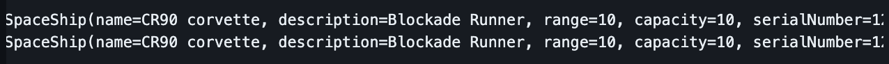

## Build Precise And Maintainable Tests With Kotest

#### Alex Kuznetsov

---

## First example: match lists

```kotlin
actual shouldBe expected
```
not easy to see what exactly is different



---

* `shouldBe` Is A Swiss Army Knife
* Does Lots Of Things
* Specialized Tools Are Better


---

## It's a recurring problem
## Let's do something about it

I am not a visionary. I'm an engineer. I'm happy with the people who are wandering around looking at the stars but I am looking at the ground and I want to fix the pothole before I fall in.

Linus Torvalds

---

## We've built a better Matcher


---

## Match Two Slices


---

##### Lessons learned:

* Kotest is designed and built by a committee
* Not very consistent, both inside and outside
* But it's a committee of us practitioners 
* 377 contributors, 4.5K stars on GitHub
* If you have a problem, maybe kotest already has a solution

---

Let's return to matching collections - kotest has much more to offer.

---

Example of specific assertion: when order does not matter


---

If kotest cannot find a match, will search for similar elements


---

How to match ordered collections if order is not completely predictable - don't be too specific


---

How to be not too specific when we match numbers

---

`BigDecimal` and scale - be specific enough, but not too much

test end result, not how it was computed


---

Double Numbers Are Not Precise - be specific enough, but not too much


---

Let's refactor a test to be more specific and less fragile

---

## Matching JSON - Naive Test

Fragile: order of keys in JSON is not guaranteed

```kotlin
toPayload(myInstance) shouldBe 
        """{"destination":"01234","send_to":"Jane Doe"}"""
```

---

the order of fields in JSON should not matter
<br/>
but this test fails:

```kotlin
"""{"destination":"01234","send_to":"Jane Doe"}""" shouldBe 
        """{"send_to":"Jane Doe","destination":"01234"}"""
```

---

## `shouldEqualJson` is Specialized, More Robust

```kotlin
"""{
    "destination":"01234",
    "send_to":"Jane Doe"
    }
    """ shouldEqualJson 
        """{"send_to":"Jane Doe","destination":"01234"}"""
```

---


## `shouldEqualJson` is Specialized, More Robust, but

if we add a new field to the object being serialized, the test will fail:

```kotlin

toPayload(
    MyPackage("01234", "Jane Doe", weight=2.34)
) shouldEqualJson 
        """{"send_to":"Jane Doe","destination":"01234"}"""
```

---

## why do we even need this test? what exactly are we verifying?

We use a very common library to serialize objects to JSON. 
<br/>
<br/>
We should not be testing that library.

---

## Real Life Example 
Passing Around Zip Codes

```kotlin
data class ZipCode(
    val zip: String
) {
    public constructor(...) {
        //custom initialization logic
    }
    init {
        //validation
    }
}
// val destination: ZipCode should serialize to JSON 
// as "destination":"01234"
// not as "destination":{"zip":"1234"}
```

---

- What we are testing: is our custom serializer properly plugged in?
- be as specific as possible
- use `shouldContainJsonKeyValue`

```kotlin
val package = MyPackage(
    destination = ZipCode(1234), 
    sendTo = "Jane Doe",
    weight = 2.34,
)
val actual = createPayload(package)
        
actual.shouldContainJsonKeyValue("destination", "01234") 
```
---

## Test One Specific Thing, Not The Whole Context

* tests will be precise and maintainable.
* but is can be more effort to write them.
* so it might or might not be worth it.
* not a blanket recommendation

---

How to be more precise when matching data classes:

* Ignore timestamps, identities, UUIDs, etc.
* need detailed description of what exactly is different

---

## Match Data Classes


---

## Match Only Some Fields


---

 `assertSoftly`
<br/>
<br/>

```kotlin
assertSoftly {
    actual.color shouldBe "red"
    actual.taste shouldBe "sweet"
}
```

---

Let's talk more about tests that are easy to maintain.
<br/>
<br/>
When a change to code causes too many changes to tests, this may be a code smell.
<br/>
<br/>
We might need to refactor.

---

Tests can be fragile because tight coupling in code being tested


---

Add an irrelevant field, need to update test


---

Use exemplar instance and `copy`


---

`canContain` should depend only on dimensions of the box and the element


---

so let's refactor our code


---

writing self-explanatory durable tests

---

Let's test upserting some data into a table


| name | before upsert | after upsert |
|------|---------------|----------------|
| apple| green         | green         |
| banana| yellow        | green         |
| cherry| -             | red           |

---

Simple test that validates too little

```kotlin
// insert test data:
// Fruit("apple", "green"),
// Fruit("banana", "yellow"),

dao.upsert(listOf(
    Fruit("banana", "green"),
    Fruit("cherry", "red"),
))

dao.getAll().size shouldBe 3
```
---

validate everything, not self-documenting

```kotlin
// insert test data:
// Fruit("apple", "green"),
// Fruit("banana", "yellow"),

dao.upsert(listOf(
    Fruit("banana", "green"),
    Fruit("cherry", "red"),
))

dao.getAll() shouldContainExactlyInAnyOrder listOf(
    Fruit("banana", "green"),
    Fruit("cherry", "red"),
    Fruit("apple", "green"),
)
```
It might be good enough already, but if not...

---

If, and only if, we need more readable test


```kotlin
val rowsToUpsert = listOf(
    Fruit("banana", "green"), 
    Fruit("cherry", "red"),
    )
val rowsToKeepUnchanged = dao.getAll().filter { 
    it.name !in rowsToUpsert.map{ it.name }
}

dao.upsert(rowsToUpsert)

dao.getAll() shouldContainExactlyInAnyOrder 
        rowsToKeepUnchanged + rowsToUpsert
```

---

### Can we still get false positives?

* `rowsToKeepUnchanged` can be empty
* `rowsToUpsert` can be same as data already saved, or empty

---

Guardian assumptions aka prerequisites

```kotlin
val (rowsToKeepUnchanged, rowsToBeChanged) = dao.getAll()
    .partitionBy {
        it.name !in rowsToUpsert.map{ it.name }
    }
withClue("rows to be unchanged should not be empty") {
    rowsToKeepUnchanged.shouldNotBeEmpty()
}
withClue("rows to be changed should not be empty") {
    rowsToBeChanged.shouldNotBeEmpty()
}
withClue("rows to be changed should change") {
    rowsToBeChanged shouldNotContainExactlyInAnyOrder
            rowsToUpsert
}
```

---

detailed matching of actual to expected 

```kotlin
assertAll {
    withClue("rows should be unchanged") {
        actual.shouldContainAll(rowsToKeepUnchanged)
    }
    withClue("rows should change") {
        actual.shouldContainAll(rowsToChange)
    }
    actual shouldContainExactlyInAnyOrder
            rowsToKeepUnchanged + rowsToUpsert
}
```

---

Test is completely self-explanatory, but it is way too long.
<br/>
<br/>
Let's split it

---

```kotlin
"upsert does not change some rows" {
    val (rowsToKeepUnchanged, rowsToBeChanged) = dao.getAll()
        .partitionBy {
            it.name !in rowsToUpsert.map { it.name }
        }
    withClue("rows to be unchanged should not be empty") {
        rowsToKeepUnchanged.shouldNotBeEmpty()
    }
    assertAll {
        withClue("rows should be unchanged") {
            actual.shouldContainAll(rowsToKeepUnchanged)
        }
        actual shouldContainExactlyInAnyOrder
                rowsToKeepUnchanged + rowsToUpsert
    }
}
```

---
Thank you!
<br/>
<br/>
Questions?